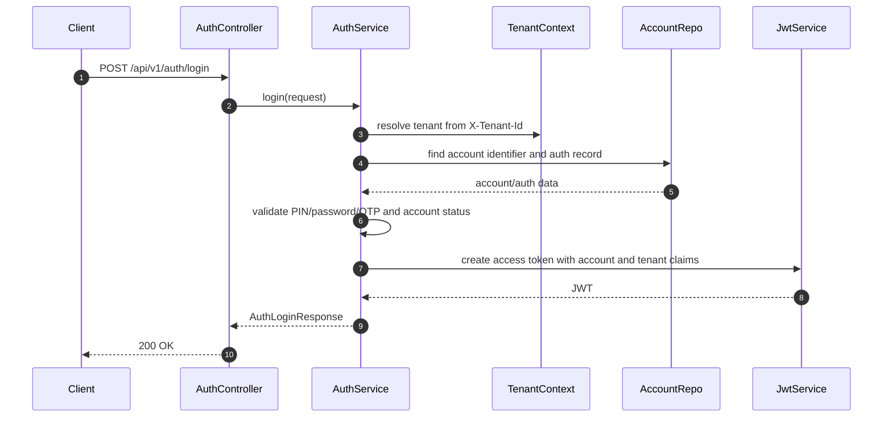
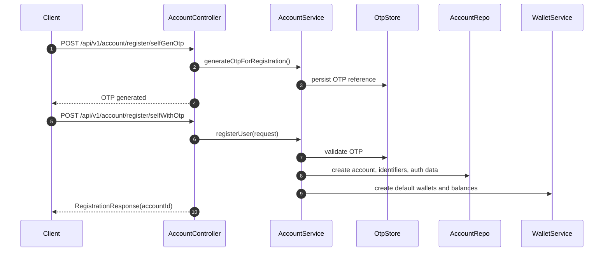
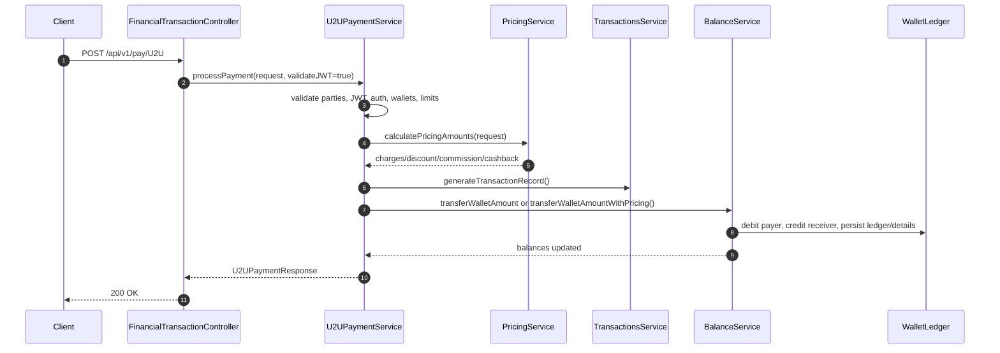
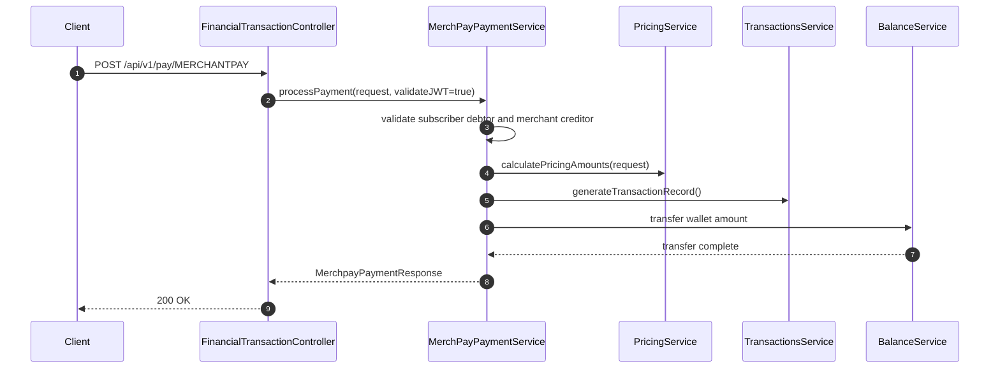
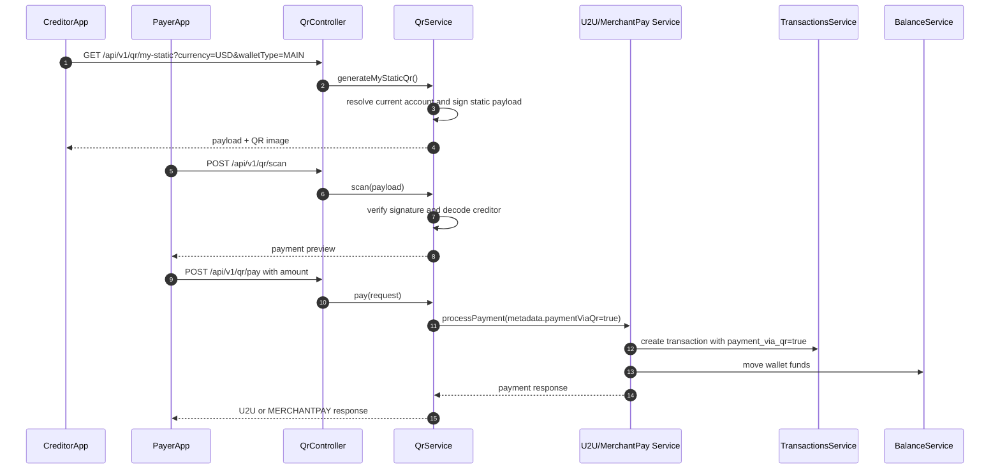
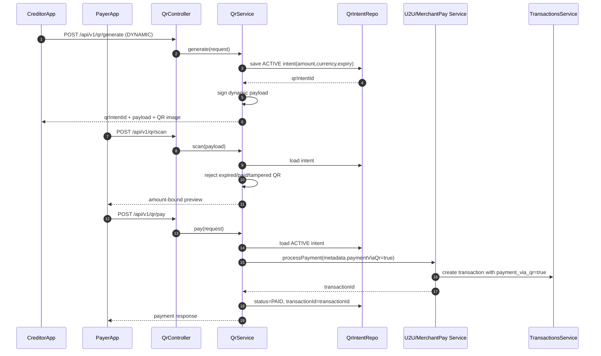
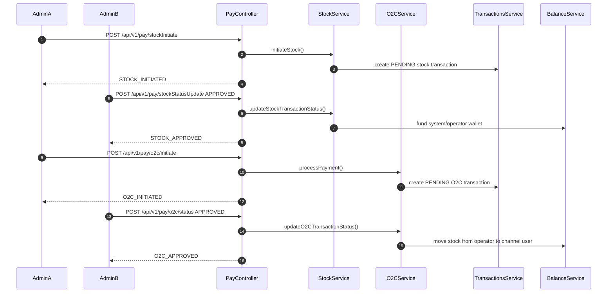
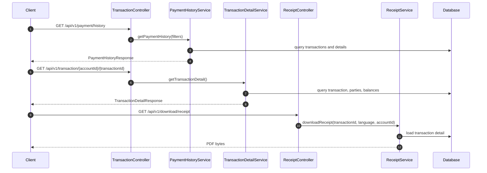

# PayNest Sequence Diagrams

The diagrams use Mermaid syntax and focus on the main runtime flows exposed by the API.

## Login

## Self Registration

## U2U Payment

## Merchant Payment

## Static QR Payment

## Dynamic QR Payment

## Stock and O2C Funding

## Transaction History and Receipt

